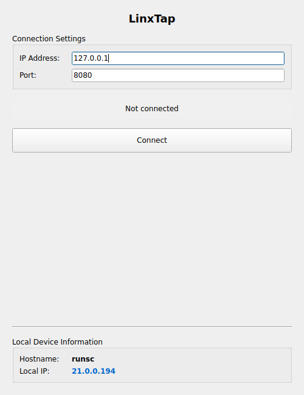

# LinxTap Quick Start Guide

LinxTap is a modern TCP/IP network client for Linux with OS detection and gateway identification.



## Installation

### Pre-built Executable (Recommended)

1. Extract the archive:
   ```bash
   tar -xzf LinxTap-linux-x64.tar.gz
   cd LinxTap
   ```

2. Make executable and run:
   ```bash
   chmod +x LinxTap
   ./LinxTap
   ```

### From Source

```bash
python -m venv venv
source venv/bin/activate
pip install -r requirements.txt
python main.py
```

## System Requirements

- **Linux**: Ubuntu 24.04+, Debian 11+, Fedora 36+, Arch Linux
- **Architecture**: x86_64 (64-bit)
- **Display**: X11 or Wayland
- **Libraries**: libEGL, libGL, libxkbcommon, libdbus (usually pre-installed)

If missing libraries, install:
```bash
# Ubuntu/Debian
sudo apt-get install libegl1 libgl1 libxkbcommon0 libdbus-1-3

# Fedora/RHEL
sudo dnf install mesa-libEGL mesa-libGL libxkbcommon dbus-libs

# Arch
sudo pacman -S libgl libxkbcommon dbus
```

## Usage

### Connecting to a Device

1. Enter **IP address** (e.g., `192.168.1.100`)
2. Enter **Port** (e.g., `8080`)
3. Click **⚡ CONNECT**

### Sending Messages

When connected:
- Type message in input field
- Press **Enter** or click **→ Send**
- View responses in message log
- Click **💾 Export** to save log

### Understanding the Information

**Status Indicators:**
- ○ Not connected (Gray)
- ● Connected (Green)
- ✗ Error/Lost (Red)

**Remote Device:**
- **OS Detection**: Based on TTL values (Linux=64, Windows=128, Cisco=255)
- **Device Type**: Shows if device is your gateway/router (orange) or network device

**Local Device:**
- **Host**: Your computer's network name
- **IP**: Your local network IP address

## Keyboard Shortcuts

- **Enter**: Send message (when in message field)
- **Alt+F4**: Close application
- **Tab**: Navigate between fields

## Troubleshooting

**App won't start:**
```bash
chmod +x LinxTap
./LinxTap
```

**Missing libraries error:**
Install required libraries (see System Requirements above)

**Connection refused:**
- Verify server is running
- Check IP address and port
- Ensure firewall allows connection

## Technical Details

- **Message Format**: UTF-8 encoded text
- **Max Response Size**: 4096 bytes
- **Response Timeout**: 1 second
- **Connection Timeout**: 5 seconds

---

**Version**: 1.0 | For development info, see [README.md](README.md)
